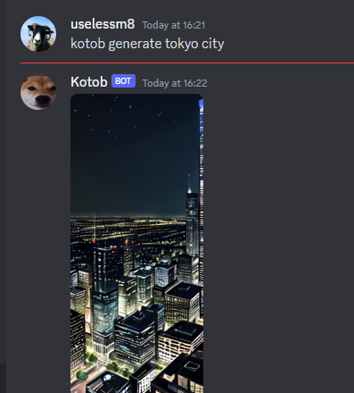

# Stable-Diffusion-Discord-bot
Python bot used for generating images via a discord chat. Made possible with Stable Diffusion API.  Runs completely locally on your PC, for it to work you first need to set up Stable DIffusion WebUI. For that visit [the installation guide](https://github.com/AUTOMATIC1111/stable-diffusion-webui/wiki/Install-and-Run-on-NVidia-GPUs).  For setting up a discord bot visit the [discord dev portal](https://discord.com/developers/applications).
## Commands
generate [your prompt]  

### Successful response by bot:

## Functionality
The bot has a working queue, so you can feed it multiple prompts at the same time. When ready, they will all be sent in the respective order.  
To change width, height, sampler or steps refer to "parameters.json" in the root folder.
